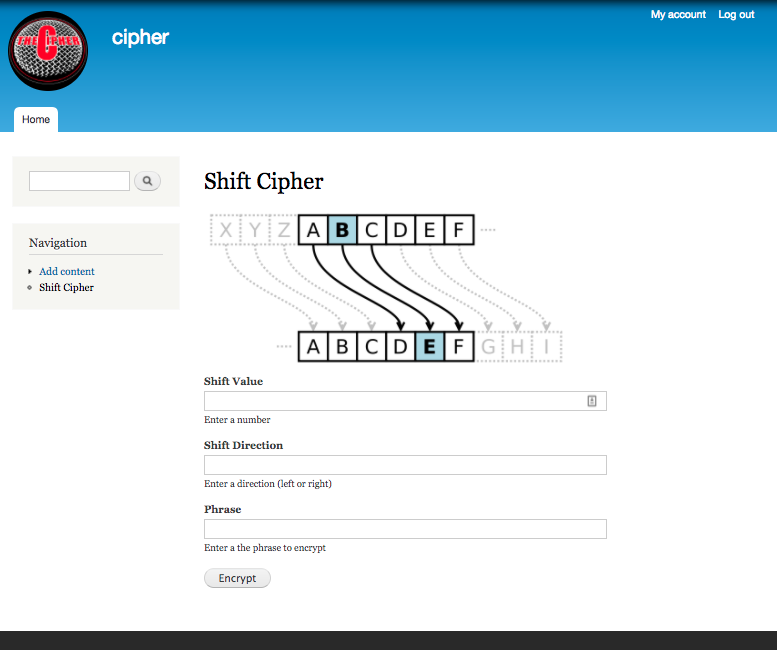

# Shift Cipher - Drupal

#### _A basic Drupal web application with a custom 'shift cipher' module, which is a recreation of Caesar's Cipher. December 2, 2016_

#### By _**Stephen Burden**_

## Specifications
| Example Behavior | Example Input | Example Output |
|------------------|---------------|----------------|
| The application will replace a letter based on shift parameters | 1, 'right', 'a' | 'b' |
| The application will return the cipher in lowercase | 1, 'right', 'A' | 'b' |
| The application will replace a string based on shift parameters | 1, 'right', 'hello' | 'ifmmp' |
| The application will account for alphabet positions | (1, 'left', 'a') OR (1, 'right', 'z') | 'z' OR 'a' |
| The application will return punctuation and spacing in the returned cipher from the user's string | 1, 'left', 'Hello, world!?' | 'gdkkn, vnqkc!?' |
| The application will prevent invalid punctuation | 1, 'right', 'Home @ 5' | 'The only special characters that are allowed in your input phrase are spaces and punctuation.' |
| The application will prevent an invalid shift direction value | 1, 'up', 'Hello world' | 'The shift direction must be either "left" or "right".' |
| The application will prevent an invalid shift value | -1, 'right', 'Hello' | 'Shift Value must be a positive integer.' |

## Prerequisites
You will need MAMP/WAMP installed on your computer.

## Setup/Installation Requirements
* In the Terminal enter `git clone <repository-url>` this repository
* Open MAMP/WAMP, go to ”Preferences" and then "Web Server". Then set your document root folder to point to our project directory, then Start Server.
* In your web browser http://localhost:8888/phpMyAdmin/ and import the `cipher.sql.zip` file (inside the sites/db-backup directory) into MySQL
* Create a database account (user: `cipher`, password: `cipher`) and Host: Local in MySQL
* To view the go to http://localhost:8888 in your web browser_
* Admin user: `cipher`, password: `cipher`

## Link
* REPO: https://github.com/spburden/shift-cipher-drupal

## Known Bugs
_There are no known bugs with this application._

## Support and contact details
_spburden@hotmail.com_

## Technologies Used
_Drupal 7.52, PHP, MAMP, MySQL, CSS_

### License
The MIT License (MIT)

Copyright (c) 2016 **_Stephen Burden_**
